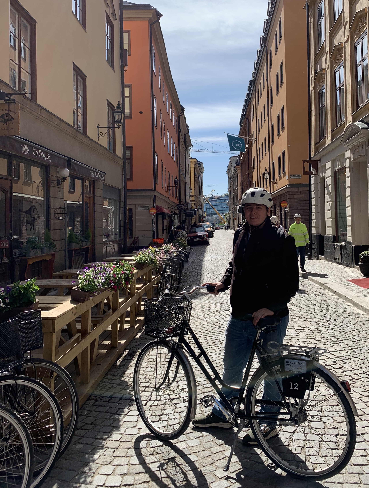

# Hello / Привет 🖥️
## I'm Efim / Ефим! 
### A coder based in San Francisco

#

# Currently 🧭
- 👷‍♂️ Full Stack Developer @ Teaching Nomad  
- 📱 Learning native iOS development

# Stack ⚙️ 
- Languages: Java, Python, JavaScript, Swift
- Backend: Spring Boot, Flask, Django, Next.js
- Frontend: React, Angular, Bootstrap, Tailwind CSS
- Data: SQL, MongoDB
- Always learning something new!

# Fun Facts
- I went to college for music
- I speak Russian fluently
- My favorite city is Stockholm, Sweden (featured in the picture above)

# Let's Build Something Together!
- efim@shulginmusic.com

<!--
**shulginmusic/shulginmusic** is a ✨ _special_ ✨ repository because its `README.md` (this file) appears on your GitHub profile.

Here are some ideas to get you started:

- 🔭 I’m currently working on ...
- 🌱 I’m currently learning ...
- 👯 I’m looking to collaborate on ...
- 🤔 I’m looking for help with ...
- 💬 Ask me about ...
- 📫 How to reach me: ...
- 😄 Pronouns: ...
- ⚡ Fun fact: ...
-->
