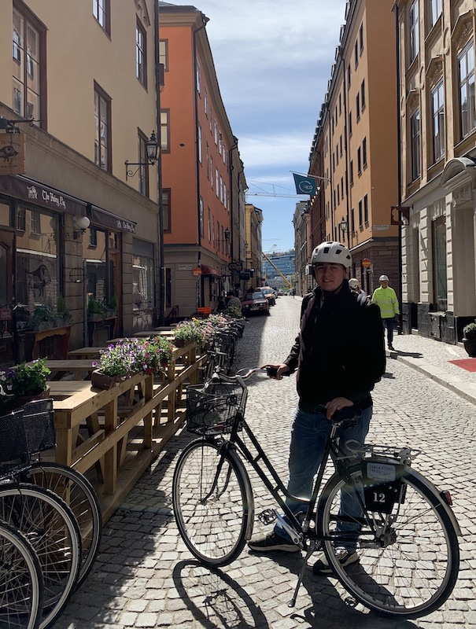

# Hello / Привет; I'm Efim / Ефим!  🖥️ 
### A coder based in San Francisco 🌁

#

# Currently 🧭
- Full Stack Developer @ Teaching Nomad 👷‍♂️   

# Stack ⚙️ 
- Languages: Java, Python, JavaScript, Swift
- Backend: Spring Boot, Flask
- Frontend: Bootstrap
- Data: SQL
- Always learning something new!

# Fun Facts ✨
- I went to college for music 🎸
- I speak Russian fluently 🪆
- My favorite city is Stockholm, Sweden (featured in the picture above) ❤️

# Let's Build Something Together! 🔨
- efim@shulginmusic.com

<!--
**shulginmusic/shulginmusic** is a ✨ _special_ ✨ repository because its `README.md` (this file) appears on your GitHub profile.

Here are some ideas to get you started:

- 🔭 I’m currently working on ...
- 🌱 I’m currently learning ...
- 👯 I’m looking to collaborate on ...
- 🤔 I’m looking for help with ...
- 💬 Ask me about ...
- 📫 How to reach me: ...
- 😄 Pronouns: ...
- ⚡ Fun fact: ...
-->
